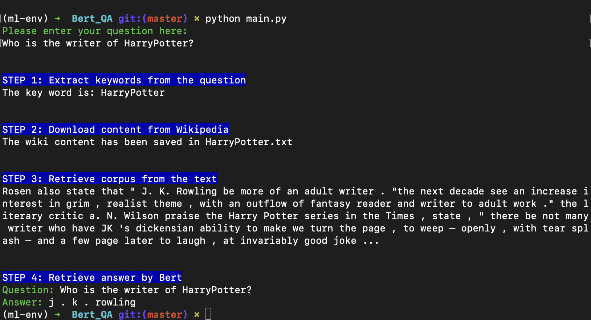

# Introduction
This is a Q&A application powered by Fine-Tuned Bert.
Run the model inference on Apple M1.
 

# Initial setup steps
### 1. clone this repo
```
https://github.com/IvyFan19/NLP_Q-A_machine.git
```
### 2. Install Python dependencies
```
cd Bert_QA
pip3 install virtualenv
python3 -m venv env
source env/bin/activate
pip3 install urllib3==1.26.6
pip3 install s
pip3 install wikipedia
pip3 install gensim==3.8.3
pip3 install torchvision 
pip3 install transformers
pip3 install colorama
python -m spacy download en_core_web_sm
```
### 3. Run this model
```
python main.py
```
